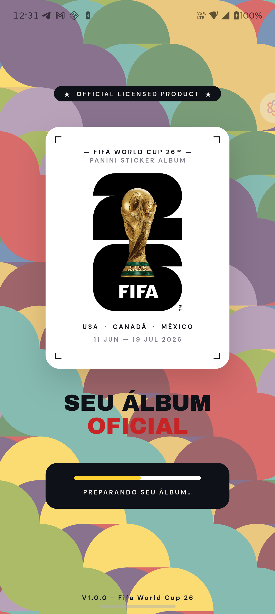
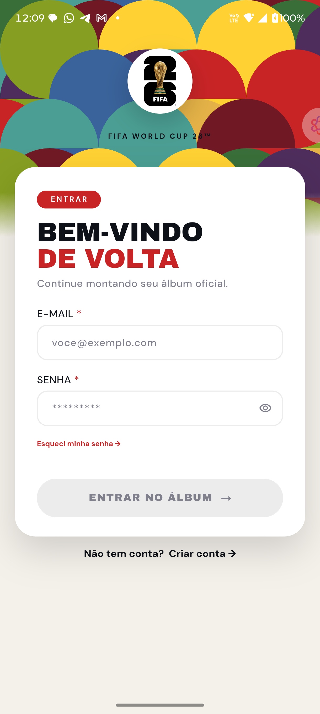
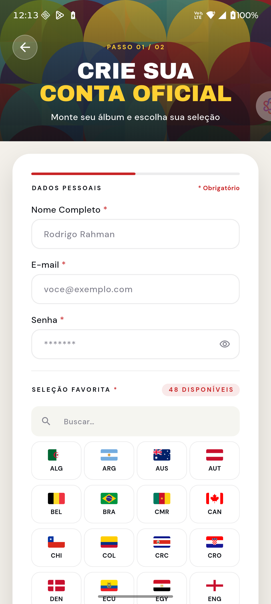
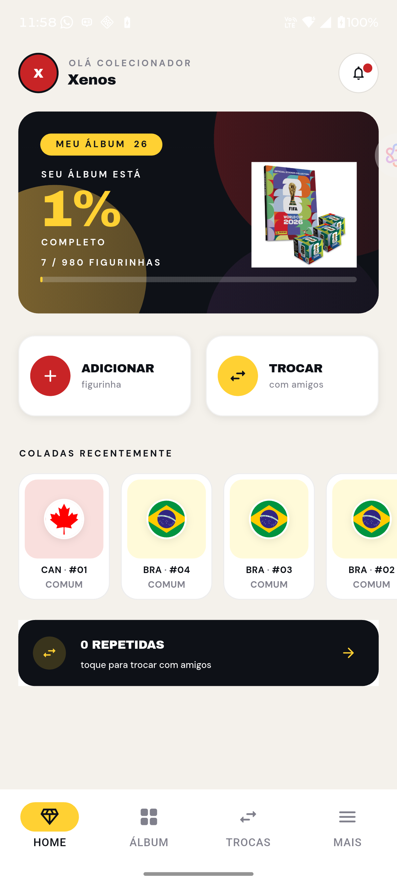
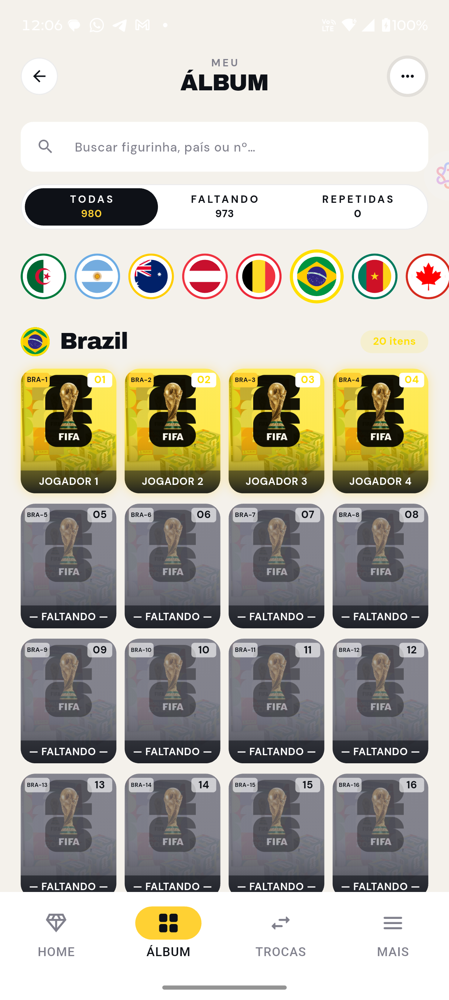
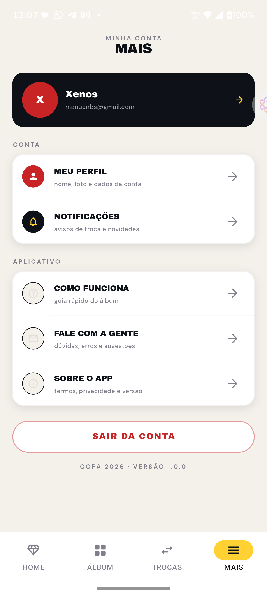

# App World Cup 2026 🏆⚽

Aplicativo desenvolvido durante o evento **Flutter Experience** — uma semana intensa de aprendizado e desenvolvimento, onde os participantes colocaram em prática conceitos modernos do Flutter construindo uma aplicação real do zero até a entrega final.

O app permite gerenciar a coleção de figurinhas do álbum da **Copa do Mundo FIFA 2026™**, com funcionalidades como visualizar o progresso do álbum, cadastrar figurinhas pelo código, ver detalhes de cada figurinha e muito mais.

---

## 📸 Telas do Aplicativo

<div align="center">
  
  
  
  
  
  
</div>

---

## 🎓 Sobre o Flutter Experience

O **Flutter Experience** é um evento imersivo de desenvolvimento mobile onde, ao longo de uma semana, os participantes aprendem e aplicam na prática conceitos avançados do Flutter. Nessa edição, o desafio foi construir um app completo e funcional com backend real, do zero até o deploy — cobrindo desde a configuração do projeto até funcionalidades como autenticação, consumo de API, gerenciamento de estado e muito mais.

### O que foi aprendido e aplicado nesse projeto:
- 🏗 **Arquitetura MVVM** com separação clara de responsabilidades
- ⚡ **Gerenciamento de estado** com o padrão `Command` e `Result<T>`
- 🌐 **Consumo de API REST** com Dio e Retrofit (geração de código automática)
- 🔐 **Autenticação e sessão** persistente com Secure Storage
- 🗺 **Roteamento** declarativo com GoRouter
- 💉 **Injeção de dependências** manual com o padrão de Bindings
- 🎨 **Design system** customizado com temas, cores e tipografia própria

---

## 🛠 Tecnologias

- **Flutter & Dart**
- **Dio + Retrofit** — HTTP Client e geração de código para a API
- **GoRouter** — Roteamento declarativo
- **Provider** — Injeção de dependências
- **Flutter Secure Storage** — Persistência segura de sessão
- **build_runner + json_serializable** — Geração de código automático

> Para mais detalhes sobre a arquitetura do projeto, consulte o [ARCHITECTURE.md](ARCHITECTURE.md).

---

## 🚀 Como rodar o projeto

1. Instale as dependências:
   ```bash
   flutter pub get
   ```
2. Gere os arquivos de código automático:
   ```bash
   dart run build_runner build -d
   ```
3. Execute o aplicativo:
   ```bash
   flutter run
   ```
